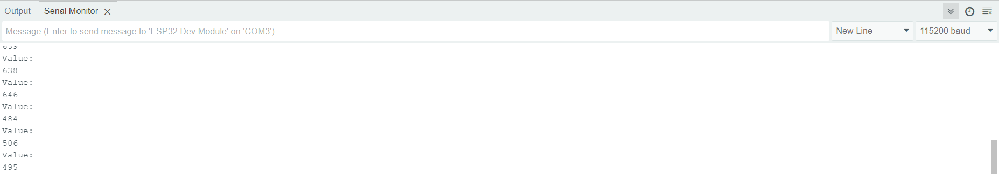
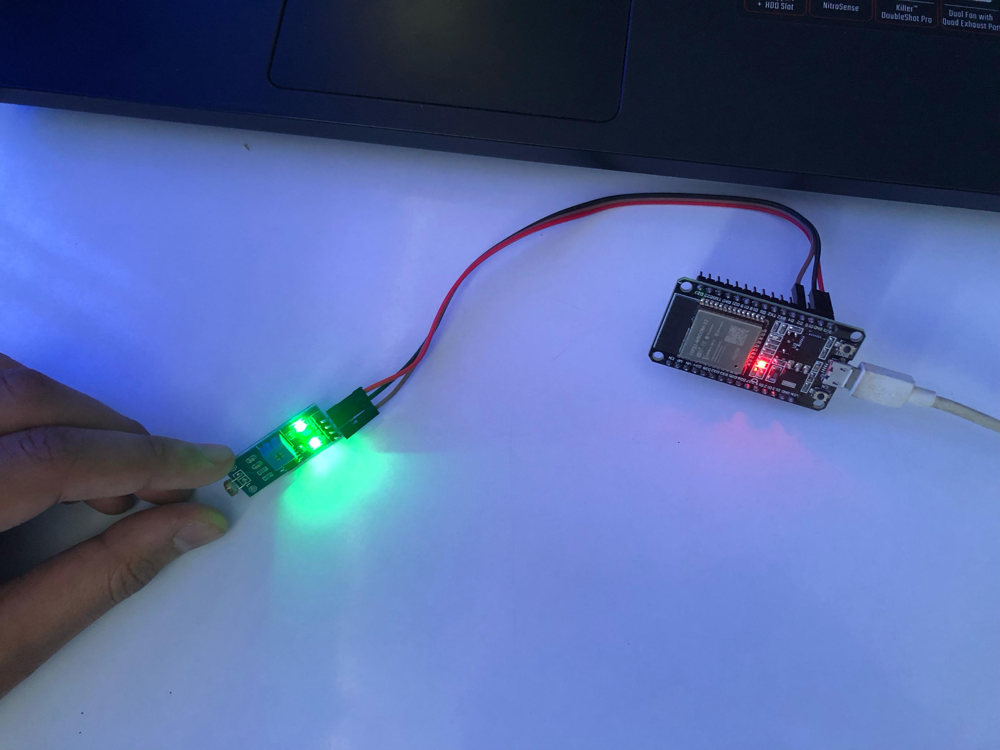

# 📘 Deskripsi Proyek
Proyek ini bertujuan untuk mengukur intensitas cahaya menggunakan sensor LDR yang terhubung dengan ESP32, lalu menampilkan data melalui Serial Monitor.

Pada praktikum ini, kami mengetes perubahan output sensor LDR dengan mencoba mengarahkan sensor ke area terang dan gelap. Selain itu, kami juga mengamati perubahan nyala lampu DO-LED pada sensor saat diarahkan ke area gelap karena menggunakan pin DO (Digital Output).

🔧 **Hardware yang Digunakan**
- ESP32
- Sensor LDR
- Jumper Wires (Female)
- Power Supply (USB ke ESP32)

📡 **Diagram Rangkaian**
| ⚡ ESP32 Pin | 🔗 LDR Pin |
|-----------|-----------|
| VCC (3.3V) | VCC |
| GND | GND |
| GPIO 2 | AO |

📥 **Instalasi Library**
Pastikan Anda telah menginstal library berikut di Arduino IDE:
1. 📂 ESP32 dev module

🚀 **Hasil:**
- Image Alat IoT

- Image hasil di Arduino

