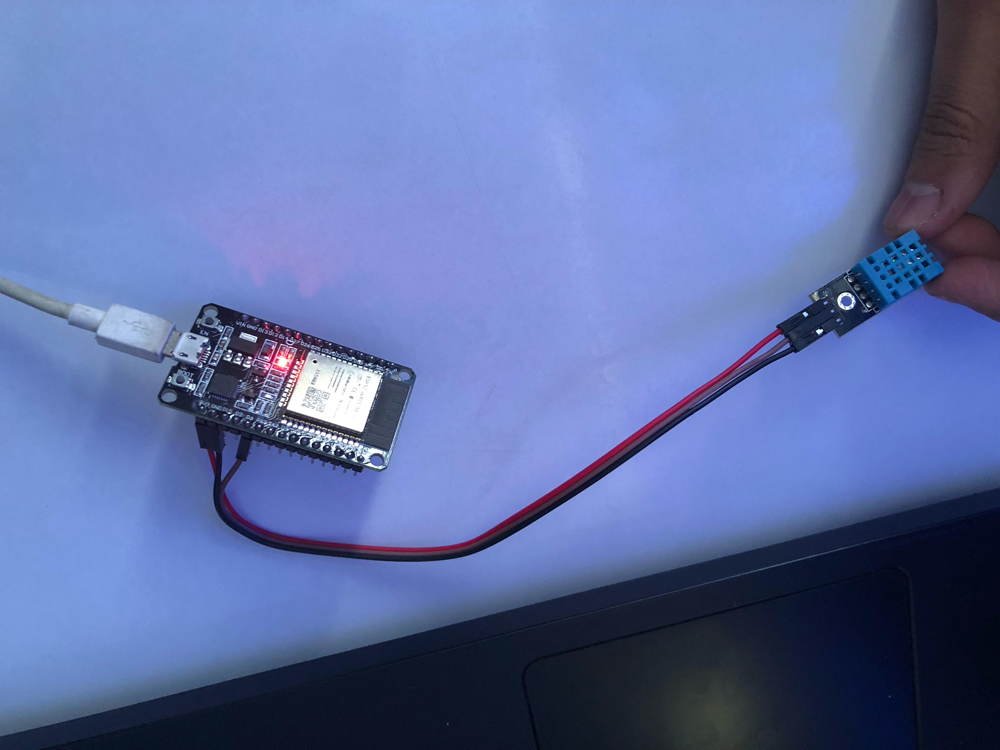
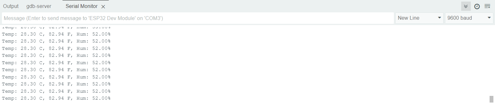

# 📘 Deskripsi Proyek
Proyek ini bertujuan untuk mengukur suhu dan kelembaban menggunakan sensor DHT11 yang terhubung dengan ESP32, lalu menampilkan data melalui Serial Monitor. 

Pada praktikum ini, kami mengetes perubahan nilai suhu dan kelembaban dari sensor DHT11 dengan menggenggam sensor. Dengan cara ini, kami dapat mengamati bagaimana sensor merespons perubahan lingkungan secara real-time.

🔧 Hardware yang Digunakan
- ESP32
- Sensor DHT11
- Jumper Wires (Female)
- Power Supply (USB ke ESP32)

📡 Diagram Rangkaian
| ⚡ ESP32 Pin | 🔗 DHT11 Pin |
|-----------|-----------|
| VCC (3.3V) | VCC |
| GND | GND |
| GPIO 4 | DATA |

📥 Instalasi Library
Pastikan Anda telah menginstal library berikut di Arduino IDE:
1. 📚 DHT sensor library
2. 📂 ESP32 dev module

🚀 Hasil:
- image alat iot

- image hasil di arduino

