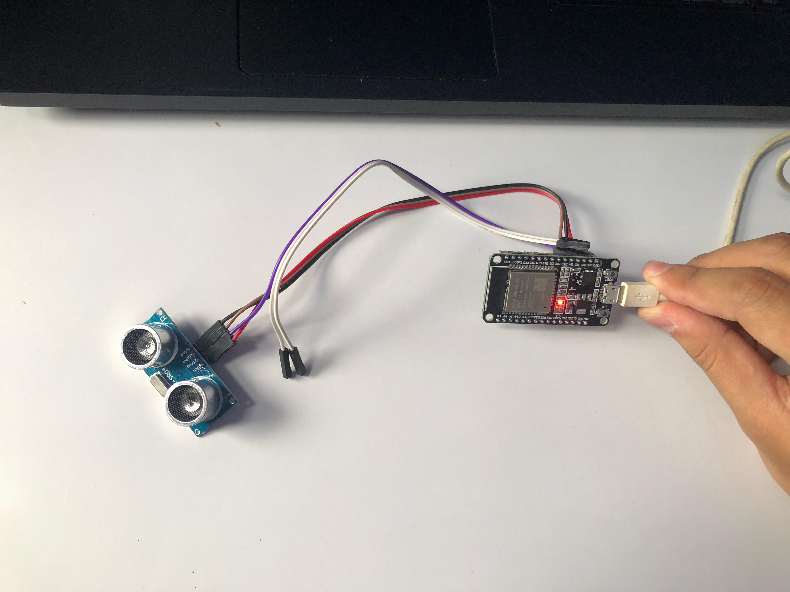
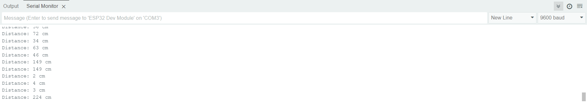

# 📘 Deskripsi Proyek
Proyek ini bertujuan untuk mengukur jarak menggunakan sensor ultrasonik HC-SR04 yang terhubung dengan ESP32, lalu menampilkan data melalui Serial Monitor.

Pada praktikum ini, kami mengetes perubahan output sensor ultrasonik dengan mengukur jarak terhadap berbagai objek dan mengamati hasil yang ditampilkan di Serial Monitor.

🔧 **Hardware yang Digunakan**
- ESP32
- Sensor Ultrasonik HC-SR04
- Jumper Wires (Female)
- Power Supply (USB ke ESP32)

📡 **Diagram Rangkaian**
| ⚡ ESP32 Pin | 🔗 HC-SR04 Pin |
|------------|--------------|
| VCC (3V3)  | VCC |
| GND  | GND |
| GPIO 4  | Trig |
| GPIO 2 | Echo |

🚀 **Hasil:**
- Image Alat IoT

- image hasil di Arduino

